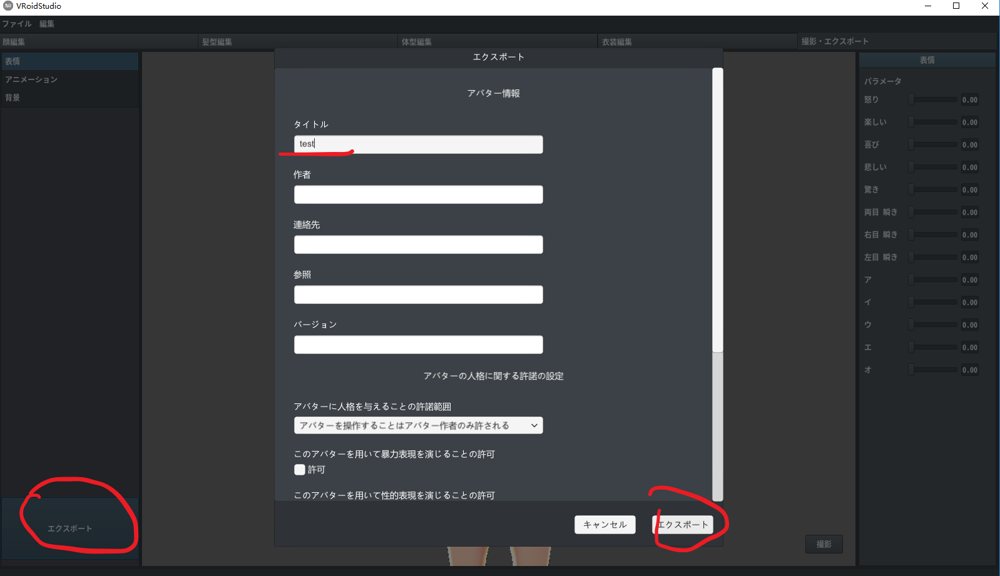
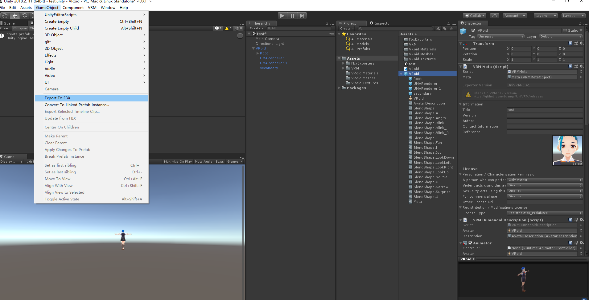
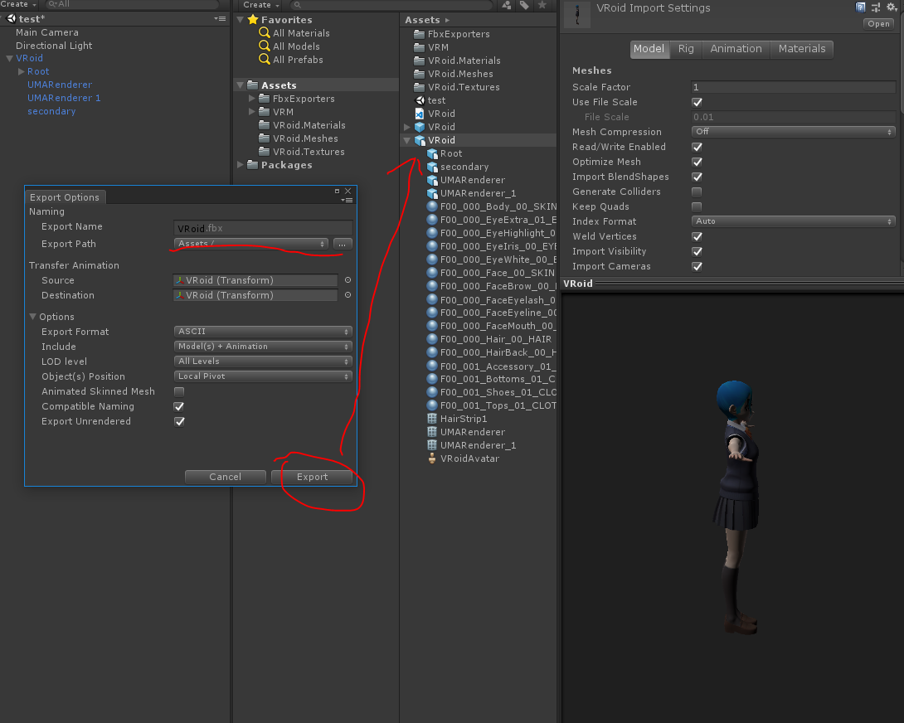
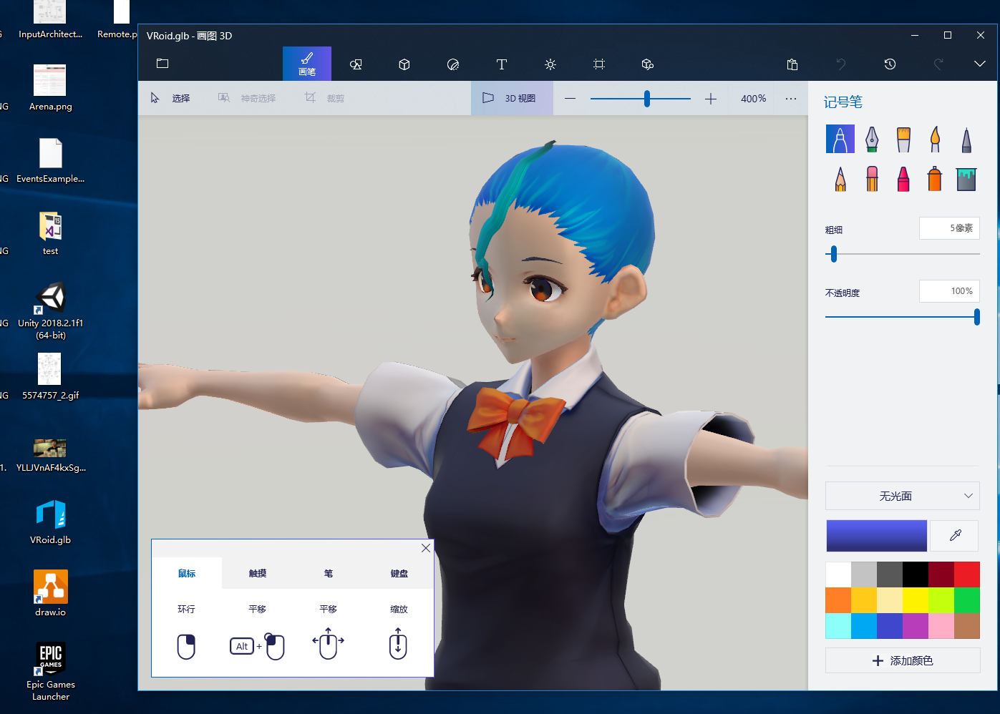
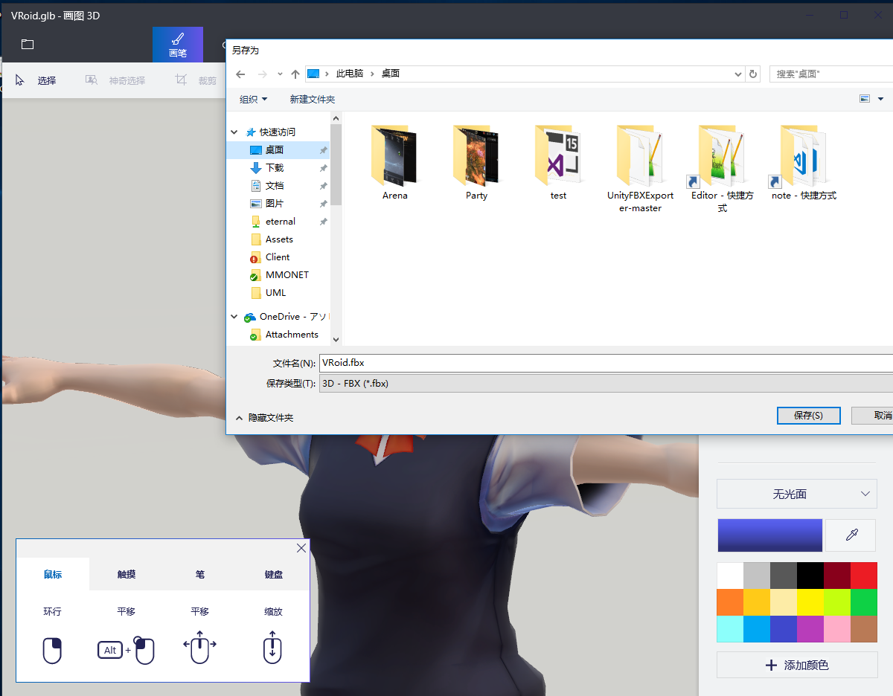
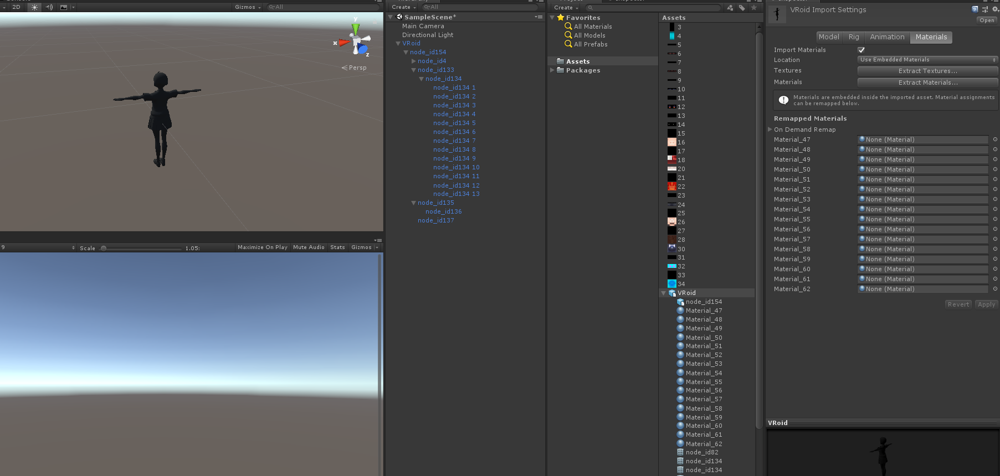
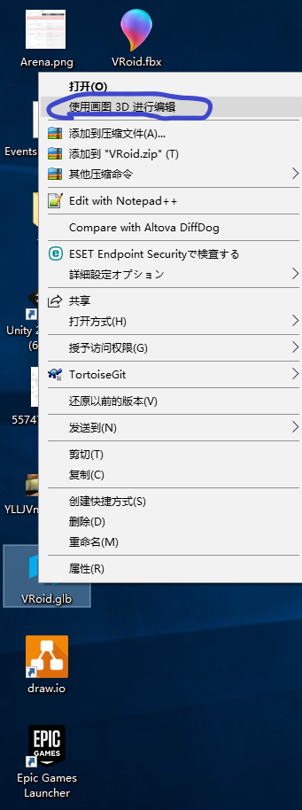

# VRoid导出方法

**如果导出报错ArgumentNullException, 请尝试 UniVRM 插件4.0 或 4.0 之前的版本。**

1. VRroidStudio中选择摄影导出页点击导出，填写title，其他项选填。
   
   

2. **推荐这个方法** ：下载Unity,推荐使用UniVRM插件，将Vroid.vrm直接拖入unity中即可。在unity中可以使用UnityFBXExport插件导出模型。
   https://github.com/dwango/UniVRM/releases
   https://assetstore.unity.com/packages/essentials/fbx-exporter-101408  

    选中自动生成的prefab，打开GameObject菜单选择导出：
    
    可以选择导出位置：
    

1. 如果不想下载unity，也可以将Vroid.vrm重命名为Vroid.glb,然后使用Win10自带的`画图3D`软件打开。
   
   

2. 在画图3D中导出fbx。
   

   
**使用画图3D导出可以保留材质数量，贴图会包含在fbx中，但是材质会变为standard，材质和贴图的关联可能会丢失。会丢骨骼。推荐使用Unity导出。**

   

根据用途选中导出方式。

**注意，重命名glb后的Win10默认打开方式是3DBuilder,这个只能导出obj。**

